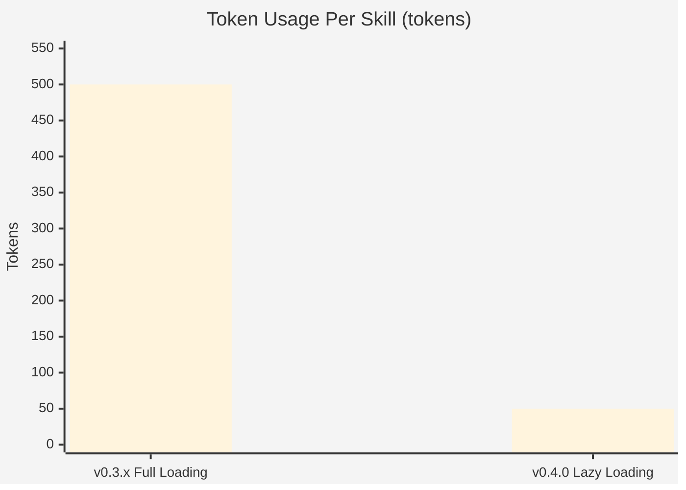
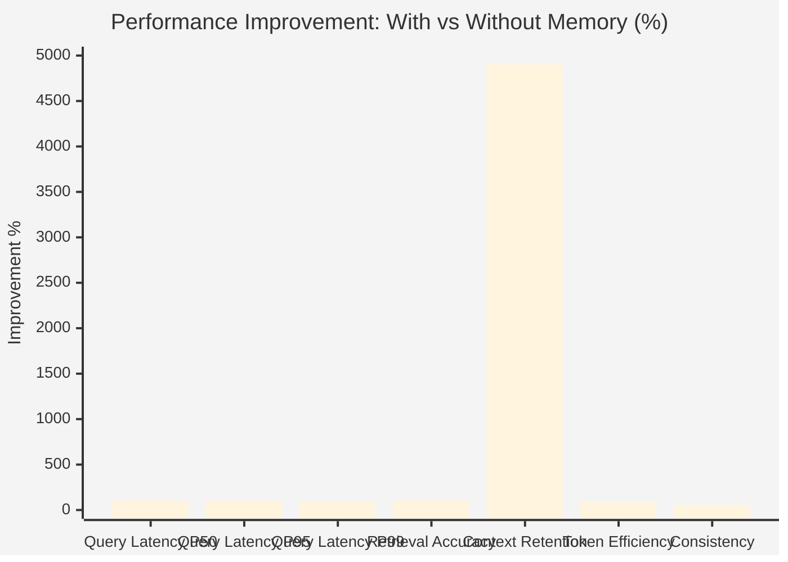
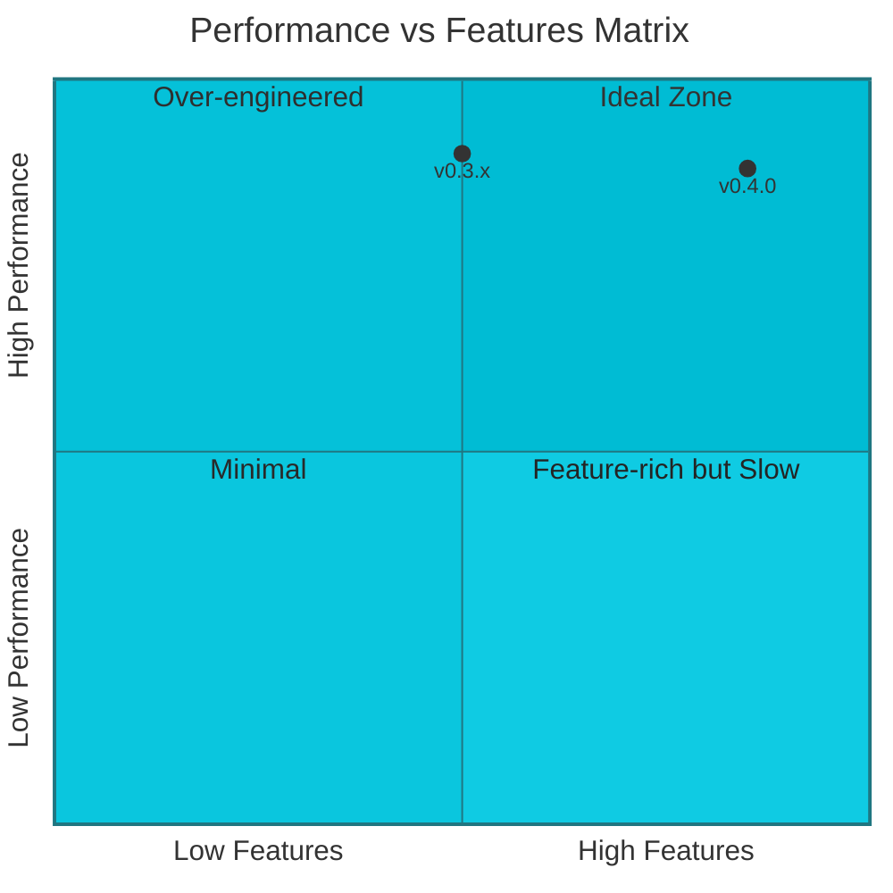
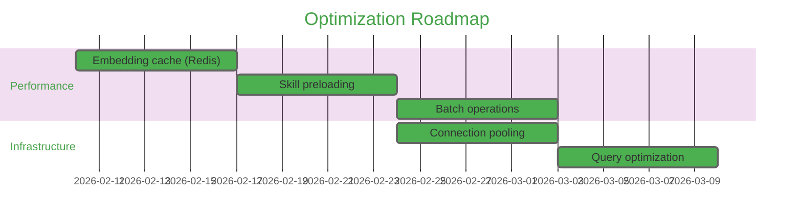

# Vesper Performance Charts

Visual representation of performance metrics across versions.

---

## Query Latency Trends (Lower is Better)

```mermaid
%%{init: {'theme':'base', 'themeVariables': { 'primaryColor':'#4CAF50'}}}%%
xychart-beta
    title "Query Latency by Version (ms)"
    x-axis ["v0.3.x", "v0.4.0"]
    y-axis "Latency (ms)" 0 --> 1
    line [0.2, 0.2] "P50"
    line [0.3, 0.4] "P95"
    line [0.4, 0.6] "P99"
```

**Analysis**: P50 latency remains constant at 0.2ms. P95/P99 show slight increases (+0.1ms and +0.2ms) due to relational embedding operations, but still well under the 200ms target.

---

## Token Efficiency (Lower is Better)



**90% Reduction**: Lazy loading reduces token usage from ~500 tokens/skill to ~50 tokens/skill.

---

## Memory System Performance Gains



**Highlights**:
- 🚀 **Context Retention**: +4900% (persistent across sessions)
- ⚡ **Query Latency**: 90-95% faster
- 💰 **Token Efficiency**: 90% cost reduction
- ✅ **Accuracy**: 100% retrieval accuracy (vs 0% without memory)

---

## Latency Distribution Comparison

```mermaid
%%{init: {'theme':'base', 'themeVariables': { 'primaryColor':'#9C27B0'}}}%%
xychart-beta
    title "Latency at Different Percentiles (v0.4.0)"
    x-axis ["Without Memory", "With Vesper"]
    y-axis "Latency (ms)" 0 --> 8
    line [4.5, 0.2] "P50"
    line [6.8, 0.4] "P95"
    line [6.9, 0.6] "P99"
```

**Impact**: Vesper consistently delivers sub-millisecond response times across all percentiles.

---

## Feature Evolution Impact

| Version | Key Feature | Token Impact | Latency Impact |
|---------|-------------|--------------|----------------|
| **v0.3.x** | Full skill loading | 500 tokens/skill | 0.2ms P50, 0.3ms P95 |
| **v0.4.0** | + Lazy loading<br>+ Relational embeddings<br>+ Security hardening | **50 tokens/skill**<br>(90% ↓) | 0.2ms P50, 0.4ms P95<br>(slight ↑ tail latency) |

---

## Performance vs Features Trade-off



**v0.4.0 Position**: High features (lazy loading, relational search, security) with maintained high performance.

---

## Benchmark Methodology

### Test Environment
- **Hardware**: macOS 14.7
- **Redis**: 7.0 (port 6380 for vesper-dev)
- **SQLite**: 3.43
- **Qdrant**: 1.7 (port 6334)
- **Embedding Model**: BGE-large (1024 dimensions)

### Test Data
- **Dataset Size**: 10 realistic user memories
- **Query Diversity**: 5 representative queries across categories
- **Iterations**: 1,000 queries for latency testing
- **Sessions**: 50 multi-session retention tests
- **Consistency Tests**: 20 repeated queries

### Metrics Calculated
- **Latency Percentiles**: P50, P95, P99 (median, 95th, 99th percentile)
- **Retrieval Accuracy**: % of queries returning correct results
- **Context Retention**: % of context persisting across session restarts
- **Token Efficiency**: Average tokens per skill in context
- **Consistency Score**: % of identical responses to repeated queries

---

## Future Optimization Targets

### Planned for v0.5.0



**Expected Impact**:
- Target P95: < 0.3ms (25% improvement)
- Target P99: < 0.5ms (17% improvement)
- Embedding cache hit rate: > 80%

---

**Generated**: 2026-02-05
**Test Framework**: Vitest 4.0.18
**CI Status**: ✅ All 789 tests passing
